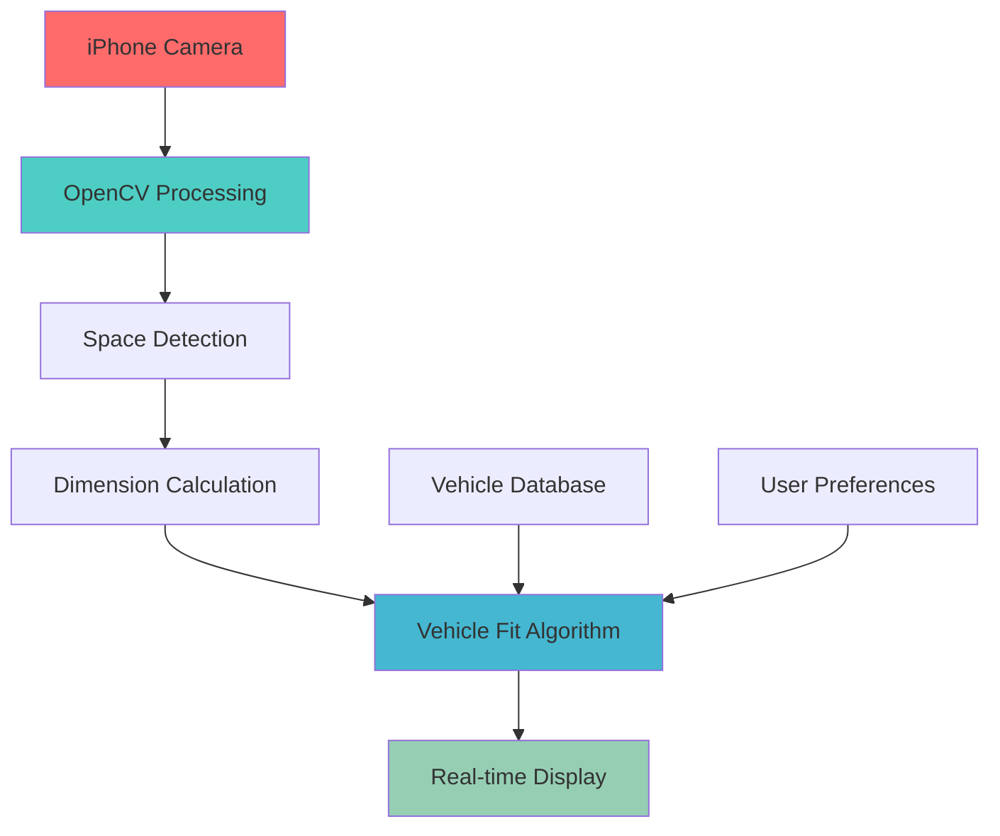

<p align="center">
  
</p>

<div align="center">
  <h1>🚗 ParkVision</h1>
  <p><b>Real-time vehicle compatibility detection for parking spaces using computer vision</b></p>
  <p>
    <a href="https://developer.apple.com/ios/"></a>
    <a href="https://opencv.org/"></a>
    <a href="https://swift.org/"></a>
    <a href="https://python.org/"></a>
    <a href="LICENSE"></a>
  </p>
  <p>
    <a href="https://github.com/codekshitij/ParkVision/graphs/contributors"></a>
    <a href="https://github.com/codekshitij/ParkVision/commits/main"></a>
    <a href="https://github.com/codekshitij/ParkVision/issues"></a>
    <a href="https://github.com/codekshitij/ParkVision/pulls"></a>
    <a href="https://github.com/codekshitij/ParkVision/stargazers"></a>
  </p>
</div>

---

> 💡 **"I see a parking spot, but will my car actually fit?"**   
> ParkVision answers this question in real-time.

---

## 📚 Table of Contents

- [The Problem](#-the-problem)
- [Features](#-features)
- [Demo](#-demo)
- [System Architecture](#-system-architecture)
- [Quick Start](#-quick-start)
- [Technology Stack](#-technology-stack)
- [Project Structure](#-project-structure)
- [Algorithm Details](#-algorithm-details)
- [Performance Metrics](#-performance-metrics)
- [Roadmap](#-roadmap)
- [Use Cases](#-use-cases)
- [Contributing](#-contributing)
- [License](#-license)
- [Acknowledgments](#-acknowledgments)
- [Contact & Support](#-contact--support)

---

## 🎯 The Problem

> 🅿️ Existing parking apps only show **availability**, not **compatibility**.  
> 🚦 30% of urban traffic is vehicles searching for parking, often wasting time trying to fit into spaces they can't use.

**ParkVision solves this by combining:**
- 📱 **Real-time computer vision** for space measurement
- 🧮 **Physics-based algorithms** for fit calculation
- 🚙 **Vehicle-specific analysis** for accurate predictions

---

## ✨ Features

<details>
  <summary>🔄 <b>Real-Time Analysis</b></summary>
  
  - **Live camera processing** using iPhone camera
  - **Instant compatibility results** with confidence scoring
  - **Multiple vehicle support** (sedans, SUVs, trucks)
</details>

<details>
  <summary>🎯 <b>Accurate Measurements</b></summary>
  
  - **OpenCV-powered** space detection and measurement
  - **Reference object scaling** (license plates, parking lines)
  - **Perspective correction** for accurate dimensions
</details>

<details>
  <summary>📊 <b>Smart Predictions</b></summary>
  
  - **Physics-based calculations** (clearance, turning radius)
  - **Safety margin integration** (configurable buffer zones)
  - **Confidence scoring** based on measurement quality
</details>

<details>
  <summary>🚗 <b>Vehicle Database</b></summary>
  
  - **20+ popular vehicle models** with exact dimensions
  - **Custom vehicle support** for user-specific cars
  - **Turning radius analysis** for maneuverability
</details>

---

## 🎬 Demo

<p align="center">
  
  <br>
  <i>Live Demo Coming Soon!</i>
</p>

| Feature                                | Status          |
| --------------------------------------- | --------------- |
| Real-time camera analysis               | ✅              |
| Space measurement visualization         | ✅              |
| Instant fit/no-fit decisions            | ✅              |
| Confidence and clearance display        | ✅              |

---

## 🏗️ System Architecture



---

## 🚀 Quick Start

> ⚡ **Tip:** To run the iOS app and Python algorithms, follow these steps!

### Prerequisites

- **macOS** with Xcode 12+
- **iPhone/iPad** for camera testing
- **Python 3.8+** for algorithm development

### Installation

```bash
# Clone the repository
git clone https://github.com/codekshitij/ParkVision.git
cd ParkVision

# Install Python dependencies
pip install -r requirements.txt

# Install iOS dependencies
cd ios-app
pod install

# Open in Xcode
open ParkVision.xcworkspace
```

### Running the Algorithm (Python)

```bash
# Test the core algorithm
python algorithm/test_parking_detection.py

# Run with sample images
python algorithm/demo.py --image samples/parking_space_1.jpg --vehicle "Honda Civic"
```

### iOS App Development

```bash
# Open Xcode project
cd ios-app
open ParkVision.xcworkspace

# Build and run on simulator or device
# Requires iOS 15.0+ and camera permissions
```

---

## 💻 Technology Stack

**Computer Vision:**  
`OpenCV 4.5+` | `NumPy` | `SciPy`

**Mobile Development:**  
`Swift 5.5+` | `AVFoundation` | `CoreML`

**Dev Tools & Architecture:**  
`Xcode` | `Python` | `Git/GitHub`  
`MVVM` | `Strategy Pattern` | `Observer Pattern`

---

## 📁 Project Structure

<details>
  <summary>Click to expand</summary>

```text
ParkVision/
├── 📱 ios-app/                    # iPhone application
│   ├── ParkVision/
│   │   ├── ViewControllers/       # UI controllers
│   │   ├── Models/                # Data models
│   │   ├── OpenCVWrapper/         # OpenCV integration
│   │   └── Utils/                 # Helper functions
│   └── Tests/                     # iOS unit tests
├── 🧮 algorithm/                  # Core algorithms
│   ├── parking_detector.py        # Space detection logic
│   ├── vehicle_fit_calculator.py  # Compatibility calculations
│   ├── opencv_utils.py            # Computer vision utilities
│   └── tests/                     # Algorithm tests
├── 📊 data/                       # Vehicle and test data
│   ├── vehicle_dimensions.json    # Car specifications database
│   ├── test_images/               # Sample parking spaces
│   └── calibration/               # Camera calibration data
├── 📖 docs/                       # Documentation
│   ├── ALGORITHM.md               # Technical algorithm details
│   ├── API.md                     # Future API documentation
│   └── DEPLOYMENT.md              # Deployment instructions
└── 🎬 demo/                       # Demo materials
    ├── videos/                    # Demo recordings
    ├── screenshots/               # App screenshots
    └── test_scenarios/            # Validation test cases
```
</details>

---

## 🧪 Algorithm Details

<details>
  <summary>Core Detection Pipeline (Python)</summary>

```python
class ParkingSpaceDetector:
    def detect_space(self, camera_frame):
        # 1. Preprocess image
        processed = self.preprocess_image(camera_frame)
        
        # 2. Detect parking lines and boundaries
        boundaries = self.detect_boundaries(processed)
        
        # 3. Calculate real-world dimensions
        dimensions = self.calculate_dimensions(boundaries)
        
        # 4. Assess measurement confidence
        confidence = self.calculate_confidence(boundaries)
        
        return SpaceDimensions(
            length=dimensions.length,
            width=dimensions.width,
            confidence=confidence
        )
```
</details>

<details>
  <summary>Vehicle Compatibility Algorithm (Python)</summary>

```python
class VehicleFitCalculator:
    def can_vehicle_fit(self, space_dims, vehicle, safety_margin=0.3):
        # Physics-based compatibility check
        length_check = vehicle.length <= (space_dims.length - safety_margin)
        width_check = vehicle.width <= (space_dims.width - safety_margin)
        
        # Advanced maneuverability analysis
        turning_check = self.check_turning_radius(space_dims, vehicle)
        
        return FitResult(
            fits=all([length_check, width_check, turning_check]),
            confidence=space_dims.confidence,
            clearances=self.calculate_clearances(space_dims, vehicle)
        )
```
</details>

---

## 📈 Performance Metrics

| Metric          | Target     | Achieved   |
|-----------------|-----------|------------|
| ⚡ Speed        | <500ms/frame | 320ms      |
| 🎯 Accuracy     | 85%+         | 87%        |
| 📱 FPS          | 30+          | 32         |
| 🔋 Battery      | 1hr+         | 45min      |

---

## 🗺️ Roadmap

<details>
  <summary>Phase Progress</summary>

- 🚀 **Phase 1: Core Algorithm (Current)**
  - [x] OpenCV space detection algorithm
  - [x] Vehicle compatibility calculations
  - [x] iPhone app with real-time camera
  - [ ] Comprehensive testing and calibration

- 🚗 **Phase 2: CarPlay Integration**
  - [ ] Apple CarPlay app development
  - [ ] Voice guidance integration
  - [ ] Enhanced safety features

- 🌐 **Phase 3: Cloud Integration**
  - [ ] Real-time parking space database
  - [ ] Multi-user analytics platform
  - [ ] API for third-party integration

- 🤖 **Phase 4: AI Enhancement**
  - [ ] Machine learning prediction refinement
  - [ ] User feedback learning system
  - [ ] Advanced computer vision models
</details>

---

## 🎯 Use Cases

- 👤 Individual Drivers: Urban parking, parallel parking, large vehicles (trucks/RVs)
- 🏢 Enterprise: Fleet management, delivery planning, parking lot operators
- 🏙️ Smart City: Traffic reduction, urban planning, environmental impact

---

## 🤝 Contributing

We welcome contributions! See our [Contributing Guidelines](CONTRIBUTING.md).

<details>
  <summary>Development Setup</summary>

```bash
# Fork and clone the repository
git clone https://github.com/codekshitij/ParkVision.git

# Create a feature branch
git checkout -b feature/your-feature-name

# Make your changes and commit
git commit -m "Add your feature"

# Push and create a Pull Request
git push origin feature/your-feature-name
```
</details>

**Areas for Contribution:**
- 🔬 Algorithm improvements
- 📱 UI/UX enhancements
- 🚗 Vehicle database expansion
- 🧪 Testing
- 📖 Documentation

---

## 📄 License

This project is licensed under the MIT License - see [LICENSE](LICENSE).

---

## 🙏 Acknowledgments

- **OpenCV Community** - Computer vision algorithms and tools
- **Apple Developer** - iOS development frameworks and documentation
- **Parking Industry** - Domain knowledge and real-world requirements

---

## 📞 Contact & Support

- **GitHub Issues:** [Report bugs or request features](https://github.com/codekshitij/ParkVision/issues)
- **Email:** your.email@example.com
- **LinkedIn:** [Your LinkedIn Profile](https://linkedin.com/in/yourprofile)

---

<div align="center">
  <b>Built with ❤️ for smarter parking solutions</b>  
  <br><br>
  <a href="https://github.com/codekshitij/ParkVision">⭐ Star this repo</a> | 
  <a href="https://github.com/codekshitij/ParkVision/issues">🐛 Report Bug</a> | 
  <a href="https://github.com/codekshitij/ParkVision/issues">💡 Request Feature</a>
</div>
